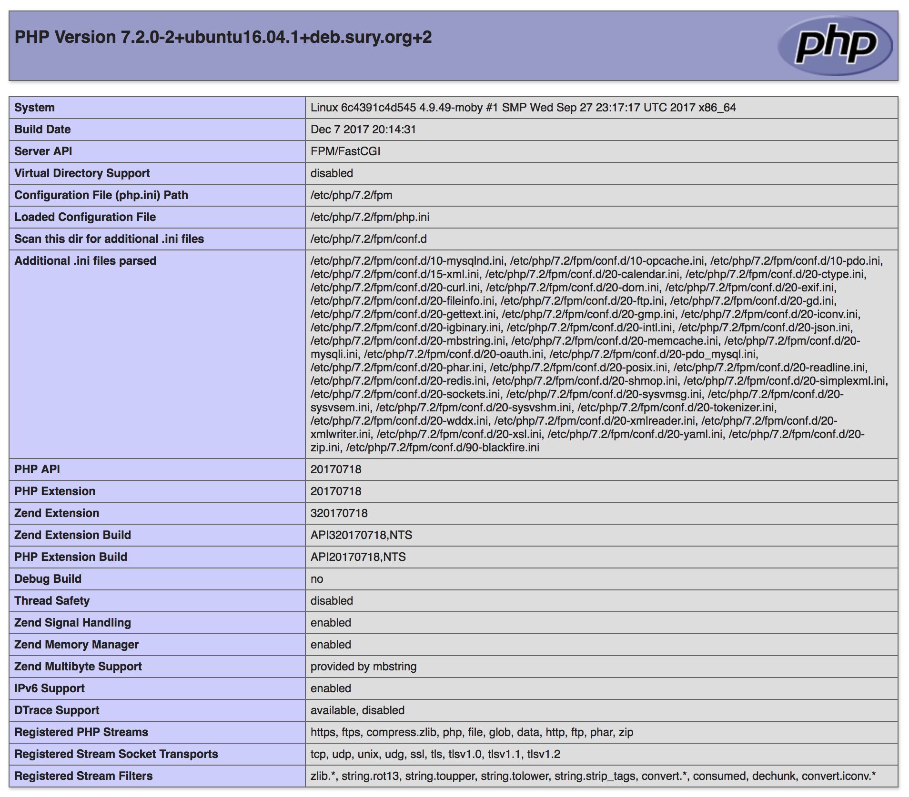
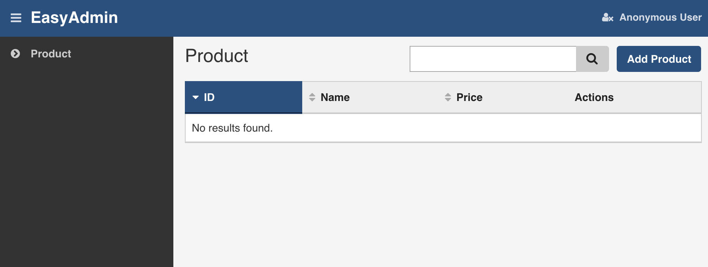

# symfony4_php7.2

This is the symfony 4 `flex` quick demo based on [this article](http://fabien.potencier.org/symfony4-demo.html) posted
on the official symfony blog. To make the test simple as possible, the docker enviroment is used for the test.
Be sure, the software package `docker` and `docker-compose` are already installed.

- [install docker engine](https://docs.docker.com/engine/installation/)
- [install dockr-compose](https://docs.docker.com/compose/install/)

The project starts two docker containers to test the symfony 4:

- flex_webapp: nginx + php7.2-fpm
- flex_db: MySQL server latest

# How to start

### build and start the containers
`bash flex.sh up`

### check if nginx, fpm works well
open a browser on:

`http://localhost:8080`

The phpinfo page should be shown correctly.

### check, if demo project works well
Open the browser on:
`http://127.0.0.1:8000/admin`

It should show the product page in admin area. 
